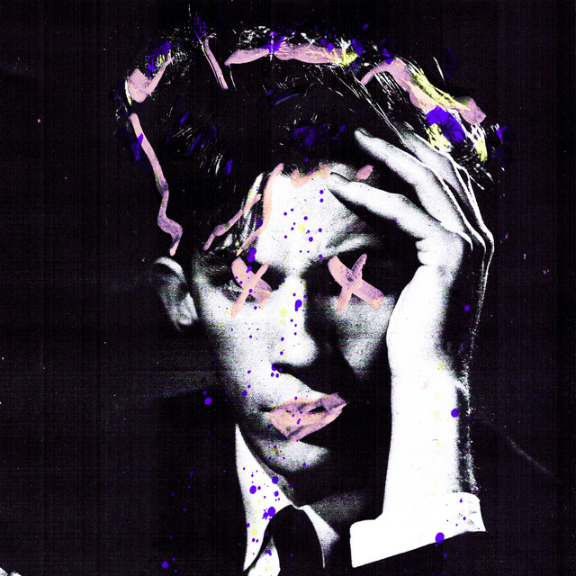
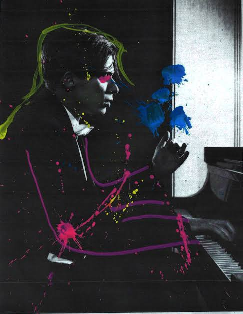
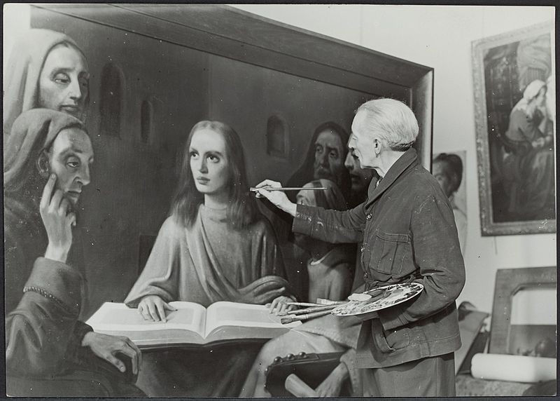
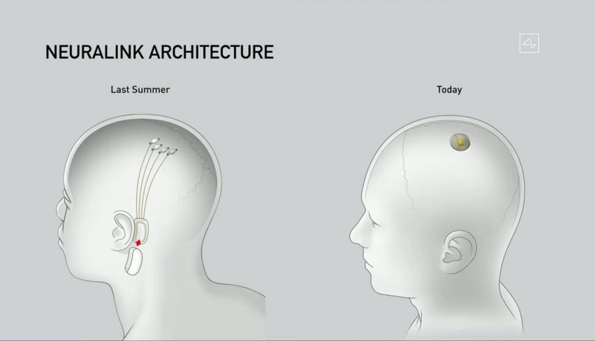

# Glenn Gould and his Cyberpunk Era
## A Commentary of the Album [Uninvited Guests](https://glenngould.com/splash-uninvited-guests/)
### Posted on Jul 6, 2026. Written on Dec 11, 2020.

* This article was originally written in Chinese, then translated to English with the help of ChatGPT with minor rivisions (see [original text](https://mp.weixin.qq.com/s/r2K7LUmmU7jqBri8jMHCMg)).

Everything that motivated me to write this article originated from a new album that was unexpectedly released some time ago by Gould's official account: Uninvited Guests.

The difference of this album is immediately apparent from its cover alone. A photograph of Gould from the 1950s collides violently with contemporary graffiti art, creating a rebellious sense of incongruity. At first, I even thought the image had come from some marketing account trying to attract attention. But I found that it was indeed officially released—and, moreover, it was the cover of an official album. Of course, "official" does not necessarily represent Gould's own wishes, considering that he has been dead for thirty-eight years. Here, "official" refers to Primary Wave, the music company that acquired the rights to Gould's estate, and Sony Music, which holds the copyright to Gould's recordings.

Uninvited Guests.

 

The decision to release this album, along with its implementation, took seven years. Moreover, considering Gould's influence in classical music, I think it is reasonable to conclude that this was not a rash decision, but one that had been deliberated over for a long time. Setting aside the commercial motivation of pursuing profit, there must also have been some more fundamental reasons behind the release of the album—reasons that can at least be justified in theory. As one of Gould's devoted admirers, I find it difficult to remain indifferent to this matter.

The album contains a total of nine tracks. Structurally, each one is fairly similar, and they also resemble most contemporary popular music—or the kind of popular music that will likely continue to develop for a long time into the future. Fragments sampled from Gould's recordings are combined with electronic rhythms and sound effects, then looped to form the accompaniment for an entire song. Vocals are then added, resulting in a piece of pop or hip-hop music.

Much like the album cover itself, each track conveys a sense of collision between the classical and the modern. After listening to the entire album, I did not feel that Gould's piano recordings occupied a particularly large portion of the music. In fact, for most listeners, replacing Gould with another pianist, or sampling a different recording altogether, would probably make little difference to the listening experience of the album as a whole. Furthermore, many of the sampled passages have been altered in both volume and rhythm.

Gould's devoted fans may recognize that this is Gould's distinctive piano tone, while some of his other admirers may angrily dismiss the album altogether, regarding it as a desecration of Gould. Indeed, on YouTube, the album has received far more dislikes than likes.

Although I myself finished listening to the album with a sense of astonished excitement, I was not surprised to see comments like these on YouTube. After all, today's classical music market caters to a certain audience that is conservative, self-important, arrogant, and excessively demanding. Even setting aside those aloof personalities and speaking only of ordinary listeners of classical music, many people simply cannot accept the transformation of pure classical music into contemporary pop music.

After giving up on finding a satisfactory explanation in the comment section, I decided to reopen the [Glenn Gould Reader](https://www.amazon.com/Glenn-Gould-Reader-Tim-Page/dp/0679731350) in search of Gould's "radical" ideas. I remembered that, in his 1966 essay "[The Prospects of Recording](https://www.sfu.ca/sonic-studio-webdav/AudioMedia/Readings/Alphabetical/Gould-Prospects_of_Recording.pdf)," he made a number of predictions about the future forms that music might take. This essay serves as Gould's argument in support of one of his own propositions: that the format of the public concert would eventually disappear from history roughly one hundred years later—that is, around the middle of the twenty-first century—and that its function would be completely replaced by electronic media. To avoid possible misunderstandings caused by translation, I also searched online for the original English text. To my surprise, I discovered that the original included section headings, which greatly improved my understanding of the essay.

Glenn Gould

 

Gould argues for his position from four different perspectives.

First, recording technology has transformed acoustics. The same musical work can achieve entirely different effects under different recording conditions. It can recreate the three-dimensional sound field of a concert hall, or it can produce something much more artificial by arranging different musical voices in different ways. For example, recordings made by Herbert von Karajan and the London Philharmonic Orchestra can yield completely different results after being processed by Deutsche Grammophon and EMI respectively. Future recording technology, he argues, will be able to overcome the acoustic limitations imposed by the concert hall itself.

Second, recording technology has made possible the performance of many works that otherwise would never have been performed. When recording an album, performers have the opportunity to conduct comprehensive research on a piece, because they no longer need to worry about audiences having to patiently sit through an entire performance. Once archived, a musical work can be picked up by listeners at any time and played selectively. In Gould's view, it is precisely those top-heavy, exaggerated performances—designed to win applause and flatter the noble occupants of the private boxes—that are the chief culprits responsible for making musical works detestable.

Third, editing technology in recording has enormously increased the possibility of making music perfect, breaking through the constraints of human imagination. Moreover, such editing often goes completely unnoticed by listeners.

Fourth, recording technology has already encouraged people to rebel against established standards. Many editors of recordings have abandoned the traditional belief—the "humanistic ideal"—that a performance is at its most perfect only when left entirely unedited.

Gould offers an interesting example. Han van Meegeren was a forger active during the 1930s. He studied the techniques of the great masters, imitated their paintings, and distributed his own works as though they were originals. His paintings were soon purchased by private collectors in the Nazi Germany as masterpieces created by famous artists. After the war in Europe ended, both he and the art dealers involved were brought before the court and held responsible for the loss of national treasures. During his defense, however, he declared that the supposed national treasures were nothing more than his own forgeries and therefore, in reality, were worthless. Historians were outraged, and he was brought to trial a second time—this time on charges of art forgery.

Han van Meegeren

 

Gould refers to this incident as the "Meegeren Syndrome." People depend upon familiar historical evidence accepted by the majority, and through this framework of analysis—rather than through the work itself—they judge the value of a work of art. It is rather like a composer whose astonishing talent earns universal praise as a genius, only to become completely worthless in the public eye after someone points out that his work may have been plagiarized.

Gould believed that, in the electronic age, the Meegeren Syndrome would no longer be condemned as a crime. Gould's predictions were undoubtedly accurate. Today, streaming media has become the primary platform through which most music is consumed. People's anticipation for new albums, in a lot of situations, has gradually surpassed their anticipation for concerts and live performances. Editing classical recordings to achieve a flawless result has become commonplace, and the size of available music libraries in the cloud has grown to an unprecedented scale.

Imitation in art—or what most people are eager to label as "plagiarism" when directed at creators—has become increasingly difficult to define clearly. Countless musicians and artists have developed distinctive personal styles precisely through imitation. This phenomenon can even be observed in other artistic fields—for example, the "Ninth Art," that is, comics and related visual narrative media. Games or software inspired by existing works can sometimes achieve even greater commercial success than the originals they imitate. The Meegeren Syndrome has already become a defining trend of our age. 

The changes brought about by an era sometimes seem unbelievable, especially when someone attempts to predict the future. Yet, in reality, those changes have long been quietly unfolding throughout people's daily lives. Gould quotes the following passage:

_"The meaning of experience is typically one generation behind the experience-the content of new situations, both private and corprate, is typically the preceding situation-the first stage of mechanical culture became aware of agrarian values and pursuits-the first age of the planter glorified the hunt-and the first age of electronic culture (the day of the telegraph and the telephone) glorified the machine as an art form."_

I could not agree more. Ever since Steve Jobs introduced the "Retina Display" on the iPhone 4, the human eye has no longer been able to distinguish individual pixels. Today, screens have replaced physical paper in most aspects of daily life. Hundreds of millions of high-resolution musical recordings now exist in the cloud, ready at any moment to reproduce lifelike sound, to the point that you no longer believe what you are hearing is merely a digital signal.
For most people, the reason for attending a live concert has gradually shifted away from "wanting to hear authentic sound quality," to "wanting to appreciate humanity." In its place, celebrity culture has become the primary attraction. This event itself may one day be replaced by technologies such as virtual reality and holographic projection. You may even find yourself chatting with an AI version of your favorite idol. The integration of humans and machines will also accelerate as Elon Musk promotes Neuralink. The arrival of something resembling cyberpunk is, in my view, merely a matter of time. By then, the original humanity will be seen as an art form.

Neuralink

 

If Gould's ideas were to be summarized briefly, one could say that he foresaw humanity's transition from a physical civilization to a digital one. I believe there will be even more debates surrounding digital civilization, just as people in the last century would never have believed that, at the beginning of the twenty-first century, a person could spend an entire day with a small glowing rectangle, achieving an indirect fusion with machines.

The direct integration of machines into the human body—even though it still seems unbelievable to many people—will become inevitable. As more and more things become "digitized," even the human mind may eventually be stored inside a computer, thereby achieving immortality. While humanity continues its exploration of the laws of the universe, the development of digitization may give birth to another infinite, artificial universe. At that point, even the origin of our own universe may acquire an entirely new explanation.

At the end of his essay, Gould writes:

_"The role of the forger, of the unknown maker of unauthenticated goods, is emblematic of electronic culture. And when the forger is done honor for his craft and no longer reviled for his acquisitiveness, the arts will have become a truly integral part of our civilization."_

It is not difficult to understand this interpretation. As online video platforms have developed to where they are today, countless people have transformed themselves from mere audiences into creators. In the process, many new forms of artistic expression have emerged—vlogs, remix videos, streamers, and many others. Everyone can now participate in creation. Once machine-learning-based composition becomes sufficiently advanced, listeners will only need to adjust a few simple settings to generate a piece of music (_Editor's note: this is [already happening](https://suno.com/)_) that is both excellent and perfectly suited to their own tastes.

If that is the case, then what is so objectionable about an album built from samples of Gould's recordings?

The "guests" have already arrived—**uninvited**.