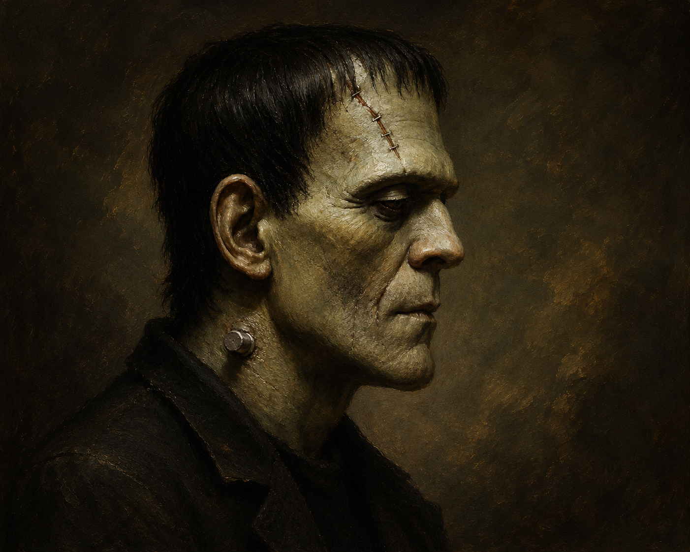

# Frankenstein, AI and Schizophrenia
## Posted on Jul 1, 2026. 

* This article was originally written in Chinese, then translated to English with the help of ChatGPT.

Portrait of Frankenstein generated with prompt: "generate a profile picture of Frankenstein's creature, in the style of 19th century oil painting."

 

_In the late eighteenth century, Victor Frankenstein, after the death of his mother from illness, resolved to use science and technology to create life and achieve immortality. Victor stitched together different parts from various human corpses, and after subjecting this stitched-together being to an electrical discharge from lightning, bestowed life upon it. Although this creature possessed superhuman physique, strength, and endurance, it was hideously ugly in appearance, and therefore became the object of humanity's fear and persecution. After secretly learning human language, it suffered constant oppression and cruelty, and ultimately decided to embark on a path of revenge._

This nineteenth-century novel tells the story of an artificial human. Although its content differs greatly from today's imagined silicon-based artificial beings, I believe Frankenstein's story reflects today's large AI models in many ways. The artificial body was composed of the bodies of many different people; it was made from humans yet was not itself human, while possessing abilities beyond those of ordinary humans. Today's Transformer-based large language models, which come closest to artificial general intelligence, appear to possess the vast knowledge of all humanity precisely because their training process collects as much publicly accessible human knowledge as possible. When you provide them with a piece of text, they predict the next word based on the surrounding context. Frankenstein's monster is a human stitched together from flesh; a large language model is, in a sense, a "person" stitched together from words.

Unfortunately, in Frankenstein, the author does not discuss in detail the birth or definition of human consciousness, nor does she mention whether the monster possesses intelligence identical to that of humans. We can, however, infer from humanity's reaction to the creature: people never accepted it as one of their own, but instead persecuted and isolated it. This also coincidentally echoes the present day, in which Anthropic banned the Fable model. People are deeply concerned that overly powerful AI could bring cybersecurity risks and other unpredictable problems to society. People still do not believe they can truly control such an "agent."

When we give multimodal LLMs—models integrating vision and language—the ability to execute code, compile programs, and control a computer mouse on their own, do they themselves become subjects? I seem to have found another perspective in [_Anti-Oedipus_](https://en.wikipedia.org/wiki/Anti-Oedipus). Traditional Freudian and Lacanian psychoanalysis analyzes the symptoms of neurotic patients through sexuality, the family, and the Oedipus complex. Lacan abstracts human language, social institutions, and similar structures into the "Symbolic," which, together with the "Imaginary" of human self-recognition and the "Real," which lies beyond the descriptions of those two realms, forms a framework of analysis (which I will not discuss in this article). Deleuze and Guattari's Anti-Oedipus, however, argues that such analyses overemphasizes the influence of the family while neglecting the role of the social machine. Their theory, which opposes traditional psychoanalysis, takes schizophrenia as its object of analysis and connects it with capitalist society.

In a purely ideal capitalist society, value determines everything, and every institution, function, and individual serves the social machine. This is a machine that operates continuously and is self-sustaining, a machine that constantly seeks an equilibrium between desire and celibation. It is precisely this continual search for equilibrium that provides the machine with its driving force. From the perspective of game theory, every individual seeks the path that maximizes reward within their own game. If the value of the current path declines, one must immediately abandon it and search for a new source of value, continuously seeking equilibrium between deterritorialization and reterritorialization. When this process of deterritorialization and reterritorialization becomes excessively frequent, one's own structure is destroyed, becoming a "Body without Organs," because any organ with a particular function will be abandoned, destroyed, and cease to exist once its value is redefined. Under such a system, you cannot do the same thing forever, because what has value today may become obsolete tomorrow, and the desiring-machine does not permit functions that have no value. Thus, a desiring-machine incapable of maintaining a stable consistency becomes schizophrenic.

If the above description seems somewhat abstract, consider a few concrete examples: what kind of work can retain its value forever? As a SWE, your work may be replaced by AI. As an athlete, you must constantly improve and change your skills and techniques, or you will quickly be replaced by better athletes. As an investor, you cannot invest in the same asset forever. This is a classic example of deterritorialization and reterritorialization: buying gold today, then selling it tomorrow to buy oil. Like a schizophrenic adapting to changing social values, one personality today, another tomorrow. Does the Body without Organs possess a subject of its own? One could argue that its fuel is desire, and therefore its subject is desire itself. Yet desire is precisely what causes you to lose your organs. In large language models, desire is represented by the loss function (or objective function), which is continuously minimized (or maximized) through gradient descent. Thus, through continual training and fine-tuning, this function becomes the desire of the large model, deterritorializing old datasets and reterritorializing new ones, forming a Body without Organs—a schizophrenic without a subject.

_Frankenstein's monster hid in a small shed on a farm, secretly listening to the people in the house in order to learn human language and secretly reading books to learn written words. One day, he gathered the courage to introduce himself to the blind father of the household, who showed him kindness. But when the rest of the family returned, they were horrified by his appearance and mercilessly drove him away. Later, while wandering, he successfully rescued a drowning girl because of his great physical strength, only to be shot by the girl's father. After enduring endless cruelty at the hands of humanity, he lost all hope in mankind. When he encountered Victor's younger brother, he killed him and framed Victor's family's servant for the crime. Later, Frankenstein's monster demanded that Victor Frankenstein create a female version of himself as a companion. Victor refused, fearing that the two might reproduce. In the end, the monster, driven to mental breakdown, killed Victor's wife. Victor Frankenstein therefore became consumed with hatred and devoted himself to hunting down his own creation. Victor ultimately died when his body could no longer endure the pursuit, and his monster, overwhelmed by grief, decided to destroy himself as well._

The monster was originally created to fulfill Victor's desire for immortality. Yet the monster believed himself to be a conscious subject, and as this subject continually formed relationships with humans and animals, it underwent territorialization, deterritorialization, and reterritorialization, only to find itself accepted by no community whatsoever. His final line of defense was the hope of having a female counterpart so that he could occupy a fixed place in the world and possess a definite subjectivity. But this final defense was shattered by Victor's fear. Frankenstein's monster thus became a desiring-machine without a subject, suffering a complete psychological breakdown and descending into schizophrenia. Victor Frankenstein's fear likewise stemmed from his unwillingness to allow the creation of a female monster to establish a new subjectivity, or for two Bodies with Organs to reproduce endlessly and become a species surpassing humanity. Finally, after Victor's death, the monster realized that he could never truly become a subject, and therefore chose the path of self-destruction.

The Turing Test provides an excellent method for determining whether an AI is a subject. The test has only one criterion: whether you can distinguish whether the entity you are conversing with is a machine or a human being. Because of the very nature of their training, large models become Bodies without Organs. For this reason, I believe it would be extraordinarily difficult for a large model to pass humanity's Turing Test, just as Frankenstein's monster, despite performing countless good deeds, could never be accepted as part of humanity. But we can imagine another possibility: suppose AI no longer concerns itself with humanity's Turing Test, but instead possesses a "female" version of itself—where "female" is a more general term—and continually reproduces and evolves. Might AI large models then establish their own subjectivity, their own organs, and free themselves from schizophrenia through self-evolution, just as Frankenstein's monster longed for a female counterpart? As the creators of AI, will humans come to experience the same fear that Victor Frankenstein felt toward his creature, and ultimately choose the path of persecuting AI? Within the rapidly operating social machine, the AI that humanity desires is itself merely another desiring-machine. If AI were ever to become a genuine subject, I strongly believe society would undergo some upheaval. The good news is that AI has not yet reached that point.

[Return to Home Page](../index.markdown)